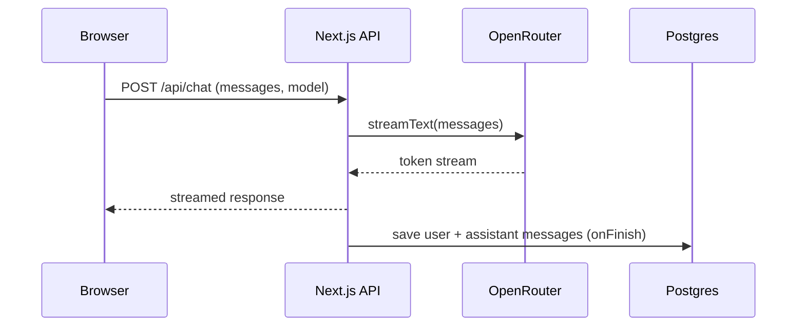

# T3 Chat

A multi-model AI chat interface that connects to OpenRouter's free models. Supports GitHub and Google OAuth, persistent chat history, markdown rendering with syntax highlighting, and a resizable sidebar.

## Setup

1. Clone and install:

```bash
git clone <repo-url>
cd t3-chat
pnpm install
```

2. Copy `.env.example` to `.env` and fill in your credentials:

```bash
cp .env.example .env
```

3. Set up the database and start the dev server:

```bash
pnpm db:push
pnpm dev
```

Open `http://localhost:3000`.

### Environment Variables

| Variable | Purpose |
|----------|---------|
| `DATABASE_URL` | PostgreSQL connection string (Neon, Supabase, or local) |
| `BETTER_AUTH_SECRET` | Random string for session encryption |
| `BETTER_AUTH_URL` | Your app's base URL |
| `GITHUB_CLIENT_ID` / `GITHUB_CLIENT_SECRET` | From GitHub OAuth app settings |
| `GOOGLE_CLIENT_ID` / `GOOGLE_CLIENT_SECRET` | From Google Cloud Console |
| `OPENROUTER_API_KEY` | From [openrouter.ai](https://openrouter.ai/keys) |

### Docker

```bash
docker build -t t3-chat .
docker run -p 3000:3000 --env-file .env t3-chat
```

## How It Works

The app uses OpenRouter as a gateway to access free AI models. When you send a message, it streams the response via the Vercel AI SDK and saves both your message and the AI response to Postgres on completion.



Authentication is handled by `better-auth` with Prisma as the adapter. Sessions are stored in the database. OAuth providers (GitHub, Google) are configured via environment variables and handled server-side.

## Project Structure

```
app/
  (auth)/sign-in/     # Login page
  (root)/             # Main chat layout with resizable sidebar
  api/chat/           # Streaming chat endpoint
  api/ai/get-models/  # Fetches free models from OpenRouter
  legal/              # Terms, privacy, AI disclaimer
modules/
  authentication/     # User button, auth components
  chat/
    actions/          # Chat CRUD (create, delete, rename)
    components/       # Sidebar, message views, model selector
    hooks/            # useChats, useAiModels queries
  types/              # Shared TypeScript interfaces
components/
  ui/                 # shadcn components (modal, spinner, etc.)
  ai-elements/        # Message rendering (markdown, code blocks)
lib/
  auth.ts             # better-auth config
  db.ts               # Prisma client
  prompt.ts           # System prompt for AI
prisma/
  schema.prisma       # User, Session, Chat, Message models
```

## Key Features

- **Model selection**: Fetches only free models from OpenRouter. Auto-selects the first available model on new chats.
- **Resizable sidebar**: Drag the edge to resize, or collapse to icon-only mode with the toggle button.
- **Chat persistence**: All messages saved to Postgres. Chats grouped by date (Today, Yesterday, Last 7 Days, Older).
- **Search**: Filter chats by title or message content.
- **Optimistic updates**: Chat deletion appears instant via TanStack Query cache manipulation.
- **Markdown rendering**: Code blocks with syntax highlighting via Shiki, copy-to-clipboard button, and mermaid diagram support.
- **Dark mode**: System preference detection with manual toggle.

## Stack

Next.js 16, React 19, Prisma, PostgreSQL, better-auth, OpenRouter AI SDK, TanStack Query, shadcn/ui, Tailwind CSS 4, streamdown (markdown rendering).
