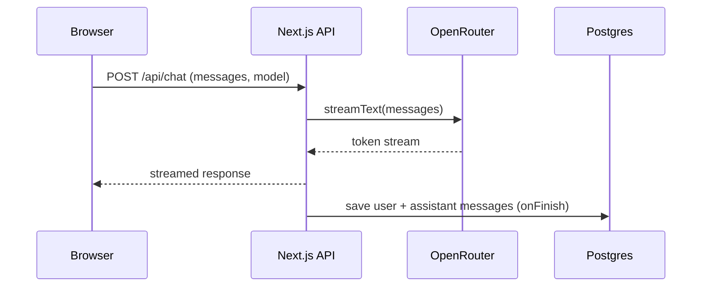
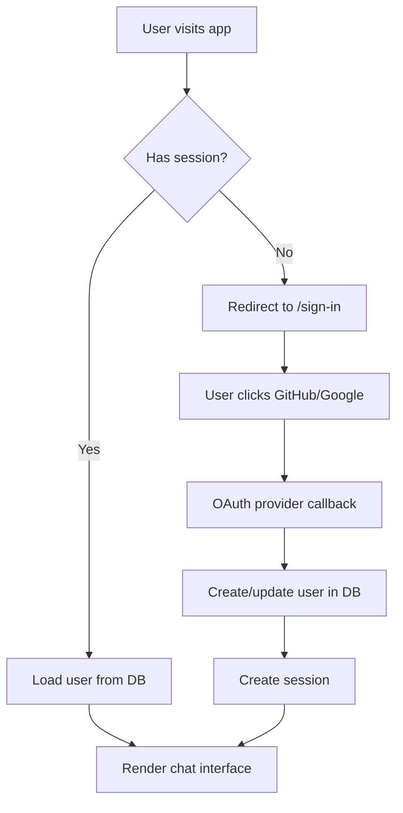
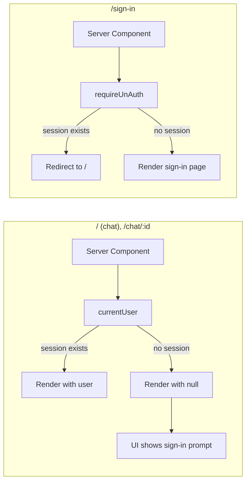

# T3 Chat Clone

A multi-model AI chat interface that connects to OpenRouter's free models. Supports GitHub and Google OAuth, persistent chat history, markdown rendering with syntax highlighting, and a resizable sidebar.

## Setup

1. Clone and install:

```bash
git clone <repo-url> t3-chat-clone
cd t3-chat-clone
pnpm install
```

2. Copy `.env.example` to `.env` and fill in your credentials:

```bash
cp .env.example .env
```

3. Set up the database and start the dev server:

```bash
pnpm db:push
pnpm dev
```

Open `http://localhost:3000`.

### Environment Variables

| Variable | Purpose |
|----------|---------|
| `DATABASE_URL` | PostgreSQL connection string (Neon, Supabase, or local) |
| `BETTER_AUTH_SECRET` | Random string for session encryption |
| `BETTER_AUTH_URL` | Your app's base URL |
| `GITHUB_CLIENT_ID` / `GITHUB_CLIENT_SECRET` | From GitHub OAuth app settings |
| `GOOGLE_CLIENT_ID` / `GOOGLE_CLIENT_SECRET` | From Google Cloud Console |
| `OPENROUTER_API_KEY` | From [openrouter.ai](https://openrouter.ai/keys) |

### Docker

```bash
docker build -t t3-chat .
docker run -p 3000:3000 --env-file .env t3-chat
```

## How It Works

### Chat Flow

The app uses OpenRouter as a gateway to access free AI models. When you send a message, it streams the response via the Vercel AI SDK and saves both your message and the AI response to Postgres on completion.



### Authentication

Auth is handled by `better-auth` with Prisma as the adapter. Sessions are stored in the database. OAuth providers (GitHub, Google) are configured via environment variables and handled server-side.



### Route Protection

Every page that requires auth calls `currentUser()` server-side. If no session exists, the user sees `null` and the UI degrades gracefully. The sign-in page uses `requireUnAuth()` — if you're already logged in, it redirects you to `/`.



## Project Structure

```
t3-chat/
├── app/
│   ├── (auth)/
│   │   └── sign-in/
│   │       └── page.tsx                 # Login page
│   ├── (root)/
│   │   ├── layout.tsx                   # Server layout, passes user
│   │   ├── layout-client.tsx            # Client layout with resizable sidebar
│   │   └── page.tsx                     # Main chat view
│   ├── api/
│   │   ├── ai/
│   │   │   └── get-models/
│   │   │       └── route.ts             # Fetches free models from OpenRouter
│   │   ├── auth/
│   │   │   └── [...all]/
│   │   │       └── route.ts             # better-auth catch-all handler
│   │   └── chat/
│   │       └── route.ts                 # Streaming chat endpoint
│   ├── legal/
│   │   └── page.tsx                     # Terms, privacy, AI disclaimer
│   ├── globals.css                      # Tailwind + code block overrides
│   └── layout.tsx                       # Root layout, fonts, metadata
├── components/
│   ├── ai-elements/
│   │   ├── message.tsx                  # Markdown/code rendering
│   │   └── reasoning.tsx                # AI reasoning display
│   ├── ui/
│   │   ├── modal.tsx                    # Reusable modal
│   │   ├── spinner.tsx                  # Loading spinner
│   │   └── resizable.tsx                # Panel components
│   ├── header.tsx                       # Top bar with theme toggle
│   └── delete-chat-model.tsx            # Delete confirmation dialog
├── lib/
│   ├── auth.ts                          # better-auth config
│   ├── auth-client.ts                   # Client-side auth helpers
│   ├── db.ts                            # Prisma client
│   └── prompt.ts                        # System prompt for AI
├── modules/
│   ├── authentication/
│   │   ├── actions/
│   │   │   └── index.ts                 # currentUser, requireAuth, requireUnAuth
│   │   └── components/
│   │       └── user-button.tsx          # User avatar + dropdown
│   ├── chat/
│   │   ├── actions/
│   │   │   └── index.ts                 # Chat CRUD (create, delete, rename)
│   │   ├── components/
│   │   │   ├── chat-sidebar.tsx          # Resapsible sidebar with chat list
│   │   │   ├── chat-view/
│   │   │   │   ├── chat-message-form.tsx # Message input with model selector
│   │   │   │   ├── chat-message-view.tsx # Main chat area
│   │   │   │   ├── chat-welcome-tabs.tsx # Welcome screen tabs
│   │   │   │   └── model-selector.tsx    # Model dropdown
│   │   │   └── messages/
│   │   │       └── message-view-form.tsx # Chat view wrapper
│   │   ├── hooks/
│   │   │   ├── use-chats.ts             # Chat list query + mutations
│   │   │   └── use-ai-models.ts         # Free models query
│   │   └── constant/
│   │       └── index.ts                 # Chat constants
│   └── types/
│       ├── AIModel.ts                   # AI model types
│       ├── ChatItemProp.ts              # Chat item interface
│       ├── ChatGroupProp.ts             # Chat group interface
│       ├── ModalProp.ts                 # Modal props interface
│       └── UserButtonProp.ts            # User button interface
├── prisma/
│   └── schema.prisma                    # User, Session, Chat, Message models
├── public/
│   ├── favicon.svg                      # T3 favicon
│   └── logo.svg                         # T3 Chat Clone logo
├── Dockerfile                           # Multi-stage Docker build
├── .env.example                         # Environment variable template
└── package.json
```

## Key Features

- **Model selection**: Fetches only free models from OpenRouter. Auto-selects the first available model on new chats.
- **Resizable sidebar**: Drag the edge to resize, or collapse to icon-only mode with the toggle button.
- **Chat persistence**: All messages saved to Postgres. Chats grouped by date (Today, Yesterday, Last 7 Days, Older).
- **Search**: Filter chats by title or message content.
- **Optimistic updates**: Chat deletion appears instant via TanStack Query cache manipulation.
- **Markdown rendering**: Code blocks with syntax highlighting via Shiki, copy-to-clipboard button, and mermaid diagram support.
- **Dark mode**: System preference detection with manual toggle.

## Stack

Next.js 16, React 19, Prisma, PostgreSQL, better-auth, OpenRouter AI SDK, TanStack Query, shadcn/ui, Tailwind CSS 4, streamdown (markdown rendering).

## License

MIT
